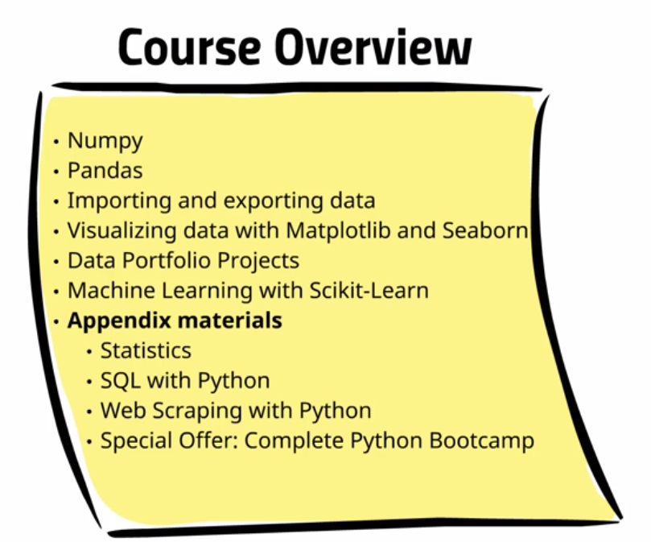
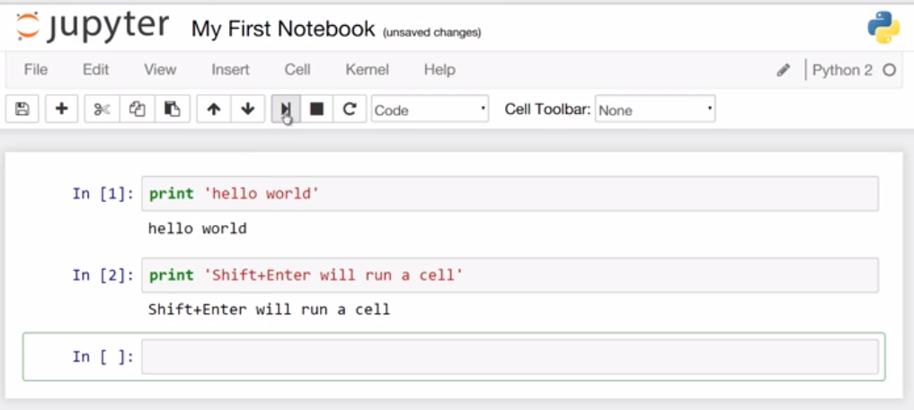

#Learning Python for Data Analysis and Visualization
##Section: 1
Intro to Course and Python
1. Course Intro


working directory c:\webStormWS\BigData\GrokkingDeepLearning>

>ImportError                               Traceback (most recent call last)
><ipython-input-1-e4e9959b303a> in <module>()
>      1 import numpy as np
>----> 2 from pandas import Series,DataFrame
>      3 import pandas as pd
>ImportError: No module named 'pandas

> pip3 install pandas

2. Course FAQs
##Section: 2
Setup
3. Installation Setup and Overview
 Link for FAQ
 
 [Link to Code Notebooks for Course!](http://nbviewer.jupyter.org/github/jmportilla/Udemy-notes/tree/master/)
 
4. IDEs and Course Resources
 [Link to Code Notebooks for Course!](http://nbviewer.jupyter.org/github/jmportilla/Udemy-notes/tree/master/)
 [Wingware](http://wingware.com)
 [komodoide](http://komodoide.com)
 
5. iPython/Jupyter Notebook Overview
 Lecture 4 Info
 Link to Code Notebooks for Course!


>pdweb.<shift+tab> will open tooltip with help on object
> <shift+enter> will run the cell

##Section: 3
Learning Numpy
6. Intro to numpy

>Intro to numpy
> Section 3, Lecture 6
> This is just a quick intro to Numpy. For this lecture go to the following links and take a quick glance at what numpy is capable of. Remember, you should have already installed numpy already using pip install numpy or conda install numpy.  
> Here is the link the official course notebooks:
> 
> http://nbviewer.jupyter.org/github/jmportilla/Udemy-notes/tree/master/
> 
> Alternative link:
> 
> https://github.com/jmportilla/Udemy-notes/tree/master/
> 
> And here are some extra resources for Numpy.
> 
> Reference for all of numpy:
> 
> http://docs.scipy.org/doc/numpy/reference/
> 
> Supplemental materials in case your interested in more than just the video lectures:
> 
> http://cs231n.github.io/python-numpy-tutorial/
> 
> Great! Now let's go ahead and get started with learning numpy with the next video lectures!
>

7. Creating arrays

[Lecture notebook](http://nbviewer.jupyter.org/github/jmportilla/Udemy-notes/blob/master/Lec%207%20-%20Creating%20Arrays.ipynb)

8. Using arrays and scalars
9. Indexing Arrays
10. Array Transposition
11. Universal Array Function
12. Array Processing
```
    import numpy as np
    import matplotlib.pyplot as plt
    %matplotlib inline
```

[Lecture notebook](http://nbviewer.jupyter.org/github/jmportilla/Udemy-notes/blob/master/Lec%2012%20-%20Array%20Processing.ipynb)

13. Array Input and Output
##Section: 4
Intro to Pandas

```
    import numpy as np
    import pandas as pd
    from pandas import Series,DataFrame
```

14. Series
15. DataFrames

from [Lecture notebook](http://nbviewer.jupyter.org/github/jmportilla/Udemy-notes/blob/master/Lec%2015%20-%20DataFrames.ipynb)


```
#Now we'll learn DataFrames

#Let's get some data to play with. How about the NFL?
import webbrowser
website = 'http://en.wikipedia.org/wiki/NFL_win-loss_records'
webbrowser.open(website)
```

16. Index objects
17. Reindex
18. Drop Entry
19. Selecting Entries
20. Data Alignment
21. Rank and Sort
22. Summary Statistics

>from IPython.display import YouTubeVideo
># For more information about Covariaance and Correlation
># Check out these great videos!
># Video credit: Brandon Foltz.
>#CoVariance
>YouTubeVideo('xGbpuFNR1ME')
https://youtu.be/xGbpuFNR1ME
Author: Brandon Foltz
Youtiube: BCFOLTZ
http: www.bcfoltz.com/blog
>#Correlation
>YouTubeVideo('4EXNedimDMs')

>ImportError                               Traceback (most recent call last)
<ipython-input-3-87208c66d1ec> in <module>()
      2 
      3 #Pandas can get info off the web
----> 4 import pandas.io.data as pdweb
      5 
      6 #Set datetime for date input

>c:\python\python35-32\lib\site-packages\pandas\io\data.py in <module>()
      1 raise ImportError(
----> 2     "The pandas.io.data module is moved to a separate package "
      3     "(pandas-datareader). After installing the pandas-datareader package "
      4     "(https://github.com/pydata/pandas-datareader), you can change "
      5     "the import ``from pandas.io import data, wb`` to "
 
>ImportError: The pandas.io.data module is moved to a separate package (pandas-datareader). After installing the pandas-datareader package (https://github.com/pydata/pandas-datareader), you can change the import ``from pandas.io import data, wb`` to ``from pandas_datareader import data, wb``.
> http://pandas.pydata.org/pandas-docs/stable/remote_data.html
>pip3 install pandas-datareader
Successfully installed pandas-datareader-0.2.1 requests-2.11.1 requests-file-1.4

change to
>import pandas_datareader as pdweb

Next error
> 14 prices = pdweb.get_data_yahoo(['PAAS','ELD','BP'], 
AttributeError: module 'pandas_datareader' has no attribute 'get_data_yahoo'

read how to retrieve data from yahoo
http://pandas-datareader.readthedocs.io/en/latest/remote_data.html

import pandas_datareader.data as web
import datetime
start = datetime.datetime(2010, 1, 1)
end = datetime.datetime(2013, 1, 27)
f = web.DataReader("F", 'yahoo', start, end)

install matplotlib
>pip3 install matplotlib
Installing collected packages: cycler, pyparsing, matplotlib
Successfully installed cycler-0.10.0 matplotlib-1.5.3 pyparsing-2.1.10


c:\webStormWS\BigData\GrokkingDeepLearning>pip3 install seaborn

    Command "c:\python\python35-32\python.exe -u -c "import setuptools, tokenize;
    __file__='C:\\Users\\PTITCH~1\\AppData\\Local\\Temp\\pip-build-2_8vo3xv\\scipy\\setup.py';
    exec(compile(getattr(tokenize, 'open', open)(__file__).read().replace('\r\n', '\n'),
     __file__, 'exec'))" install 
     --record C:\Users\PTITCH~1\AppData\Local\Temp\pip-2mg60u4_-record\install-record.txt 
     --single-version-externally-managed --compile" 
     failed with error code 1 in C:\Users\PTITCH~1\AppData\Local\Temp\pip-build-2_8vo3xv\scipy\

http://stackoverflow.com/questions/12628164/trouble-installing-scipy-on-windows

look @ lecture 47
http://stanford.edu/~mwaskom/software/seaborn/installing.html
download winpython WinPython-64bit-3.4.4.4Qt5 which suppose to include scipy 
https://sourceforge.net/projects/winpython/?source=typ_redirect
run installation into C:\Python
need to fix global path? Yes


Add import seaborn
>import seaborn as sns

    ImportError                               Traceback (most recent call last)
    <ipython-input-1-0e9fb0cd5868> in <module>()
          2 from pandas import Series,DataFrame
          3 import pandas as pd
    ----> 4 import seaborn as sns
          5 sns.set_style('whitegrid')
          6 get_ipython().magic('matplotlib inline')
    ImportError: No module named 'seaborn'


23. Missing Data
24. Index Hierarchy
##Section: 5
Working with Data: Part 1
25. Reading and Writing Text Files
26. JSON with Python
27. HTML with Python
28. Microsoft Excel files with Python
##Section: 6
Working with Data: Part 2
29. Merge
30. Merge on Index
31. Concatenate
32. Combining DataFrames
33. Reshaping
34. Pivoting
35. Duplicates in DataFrames
36. Mapping
37. Replace
38. Rename Index
39. Binning
40. Outliers
41. Permutation
##Section: 7
Working with Data: Part 3
42. GroupBy on DataFrames
43. GroupBy on Dict and Series
44. Aggregation
45. Splitting Applying and Combining
46. Cross Tabulation
##Section: 8
Data Visualization
47. Installing Seaborn
install all at once with winpython

48. Histograms


49. Kernel Density Estimate Plots
    youtube: плотность распределения случайной величины
    
50. Combining Plot Styles
51. Box and Violin Plots

    # Now we'll learn about box and violin plots
    url = 'http://en.wikipedia.org/wiki/Box_plot#mediaviewer/File:Boxplot_vs_PDF.svg'
    russian mirror https://ru.wikipedia.org/wiki/%D0%AF%D1%89%D0%B8%D0%BA_%D1%81_%D1%83%D1%81%D0%B0%D0%BC%D0%B8
    

52. Regression Plots

[jitters](http://en.wikipedia.org/wiki/Jitter)
[russian](https://ru.wikipedia.org/wiki/%D0%94%D0%B6%D0%B8%D1%82%D1%82%D0%B5%D1%80)

for colors look in matplot source code
C:\Python\WinPython-64bit-3.4.4.4Qt5\python-3.4.4.amd64\Lib\site-packages\matplotlib\colors.py

# Finally it should be noted that Seabron supports LOESS model fitting
[url](http://en.wikipedia.org/wiki/Local_regression)

53. Heatmaps and Clustered Matrices
##Section: 9
Example Projects.
54. Data Projects Preview
If you want, go ahead and just go for it with these free public data set resources:

    http://www.data.gov/
    http://aws.amazon.com/public-data-sets/
    http://www.google.com/publicdata/directory

55. Intro to Data Projects
 First Data Project
56. Titanic Project - Part 1
 First Data Project
57. Titanic Project - Part 2
58. Titanic Project - Part 3
59. Titanic Project - Part 4
60. Intro to Data Project - Stock Market Analysis
61. Data Project - Stock Market Analysis Part 1
62. Data Project - Stock Market Analysis Part 2
63. Data Project - Stock Market Analysis Part 3
64. Data Project - Stock Market Analysis Part 4
65. Data Project - Stock Market Analysis Part 5
66. Data Project - Intro to Election Analysis
67. Data Project - Election Analysis Part 1
68. Data Project - Election Analysis Part 2
69. Data Project - Election Analysis Part 3
70. Data Project - Election Analysis Part 4

##Section: 10
Machine Learning
###71. Introduction to Machine Learning with SciKit Learn
[look at root repository](http://nbviewer.jupyter.org/github/jmportilla/) for __Machine Learning__ folder

- there are lot of interesting notebooks
- Udemy---Machine-Learning   Introduction to Machine Learning.ipynb
- open [Machine Learning](http://nbviewer.jupyter.org/github/jmportilla/Udemy---Machine-Learning/tree/master/)

>In this course we will be focusing on very practical hands on applications of machine learning using the [SciKit Learn](http://scikit-learn.org/stable/) module for Python.
 Install it using either pip install scikit-learn or conda install scikit-learn depending on your installation.

__Already installed!!!__

>Free Additional Online Resource for Machine Learning:
  1) SciKit Learn's own Documentation is fantastic! They have their own basic tutorial:
  [SciKit Learn Tutorial](http://www.astroml.org/sklearn_tutorial/general_concepts.html)
  2) Nice Introduction Overview from [Toptal](http://www.toptal.com/machine-learning/machine-learning-theory-an-introductory-primer)
  3) This [free online book](http://robotics.stanford.edu/people/nilsson/MLBOOK.pdf) by Stanford professor Nils J. Nilsson.
  4) Andrew Ng's Machine Learning Class [notes](http://cs229.stanford.edu/materials.html)
  [Coursera Video](https://www.coursera.org/learn/machine-learning)
  Andrew Ng's class delves very nicely into the mathematics of a lot of machine learning. They are also available on youtube for free. Note: He does not use the scikit learn library or the Python language. 
 
72. Linear Regression Part 1
>If you're interested in the deeper mathematics of linear regession methods, check out the [wikipedia page](http://en.wikipedia.org/wiki/Linear_regression) and also check out Andrew Ng's wonderful lectures for free on [youtube](https://www.youtube.com/watch?v=5u4G23_OohI).
 In this section we will be working through linear regression with the following steps:
 Step 1: Getting and setting up the data.
 Step 2: Visualizing current data.
 Step 3: The mathematics behind the Least Squares Method.
 Step 4: Using Numpy for a Univariate Linear Regression.
 Step 5: Getting the error.
 Step 6: Using scikit learn to implement a multivariate regression.
 Step 7: Using Training and Validation.  
 Step 8: Predicting Prices
 Step 9 : Residual Plots


73. Linear Regression Part 2
74. Linear Regression Part 3
75. Linear Regression Part 4
76. Logistic Regression Part 1

[Original notebook](http://nbviewer.jupyter.org/github/jmportilla/Udemy---Machine-Learning/blob/master/Supervised%20Learning%20-%20Logistic%20Regression.ipynb)

You'll need to install a new module we haven't used before: [Statsmodels](http://statsmodels.sourceforge.net/).

    pip3 install statsmodels


77. Logistic Regression Part 2
78. Logistic Regression Part 3
79. Logistic Regression Part 4
80. Multi Class Classification Part 1 - Logistic Regression
81. Multi Class Classification Part 2 - k Nearest Neighbor
82. Support Vector Machines Part 1
83. Support Vector Machines - Part 2
84. Naive Bayes Part 1
85. Naive Bayes Part 2
86. Decision Trees and Random Forests
87. Natural Language Processing Part 1
88. Natural Language Processing Part 2
89. Natural Language Processing Part 3
90. Natural Language Processing Part 4
##Section: 11
Appendix: Statistics Overview
91. Intro to Appendix B

- jupyter notebooks [Viewer Link For Stats Notes](http://nbviewer.ipython.org/github/jmportilla/Statistics-Notes/tree/master/)

92. Discrete Uniform Distribution
93. Continuous Uniform Distribution
94. Binomial Distribution
95. Poisson Distribution
96. Normal Distribution
97. Sampling Techniques
98. T-Distribution
99. Hypothesis Testing and Confidence Intervals
100. Chi Square Test and Distribution
101. Bayes Theorem
##Section: 12
Appendix: SQL and Python
102. Introduction to SQL with Python
103. SQL - SELECT,DISTINCT,WHERE,AND & OR
104. SQL WILDCARDS, ORDER BY, GROUP BY and Aggregate Functions
##Section: 13
Appendix: Web Scraping with Python
105. Web Scraping Part 1
106. Web Scraping Part 2
##Section: 14
Appendix: Python Special Offers
107. Python Overview Part 1
108. Python Overview Part 2
109. Python Overview Part 3
##Section: 15
BONUS: SPECIAL DISCOUNT COUPONS

##TODOs 
- check __gretl__ module in python [publication on subject](https://793d0f2d-a-cf572b13-s-sites.googlegroups.com/a/gretlconference.org/gretlconference/2009/proceedings/book2009-14.pdf?attachauth=ANoY7crRKLXVOfpoYfPU4nonAP1wM4jioSoSXM6GdzhwIEjL8pRXivc7f0689zykUWiELoM7zndqvyHrJFqVE8ezoftMFUtEWuUlyJ6c40d5Vv0175VKr_UH4vWa5yBdZhRlhbJ3EX8qEywYbRIy7UdlmbSGeGmUBWYz5X9ZS1pN4zSw_4fExw1ltKZP3DMS518FtnKJzI7dCoFQpafQ9azq2r2iRsYvQ9WZFxUCvGnN9vXGlu_6VzROsKoFq9V4Fkf3I-9_WsUc&attredirects=0)

>The scripting language that we have chosen to embed Gretl in is Python,
 which is free, open-source and available on many platforms. Python is indeed
 a very powerful, easy-to-learn and well-documented language with a very clear
 syntax. Writing and distributing documented Python modules is simple as well.
 Matrices are not a native Python data type. However, the very mature project
 NumPy4 provides an efficient implementation of N−dimensional arrays
 
 Jupyter allows import to pdf - all you need is to install pandoc
 
     c:\webStormWS\BigData\GrokkingDeepLearning>pip3 install pandoc
     Collecting pandoc
       Downloading pandoc-1.0.0b2.tar.gz (516kB)
         100% |################################| 522kB 747kB/s
     Collecting ply (from pandoc)
       Downloading ply-3.9.tar.gz (150kB)
         100% |################################| 153kB 1.3MB/s
     Building wheels for collected packages: pandoc, ply
       Running setup.py bdist_wheel for pandoc ... done
       Stored in directory: C:\Users\ptitchkin\AppData\Local\pip\Cache\wheels\6f\50\45\4477787679133c1ccdb0f65c324cb05fd40e679767b89db6b0
       Running setup.py bdist_wheel for ply ... done
       Stored in directory: C:\Users\ptitchkin\AppData\Local\pip\Cache\wheels\c1\0c\bd\306a63396decbe8353a4a056fcba97a092be0e035522bc567d
     Successfully built pandoc ply
     Installing collected packages: ply, pandoc
     Successfully installed pandoc-1.0.0b2 ply-3.9
     
nbconvert failed: Pandoc wasn't found.
Please check that pandoc is installed:
http://pandoc.org/installing.html 